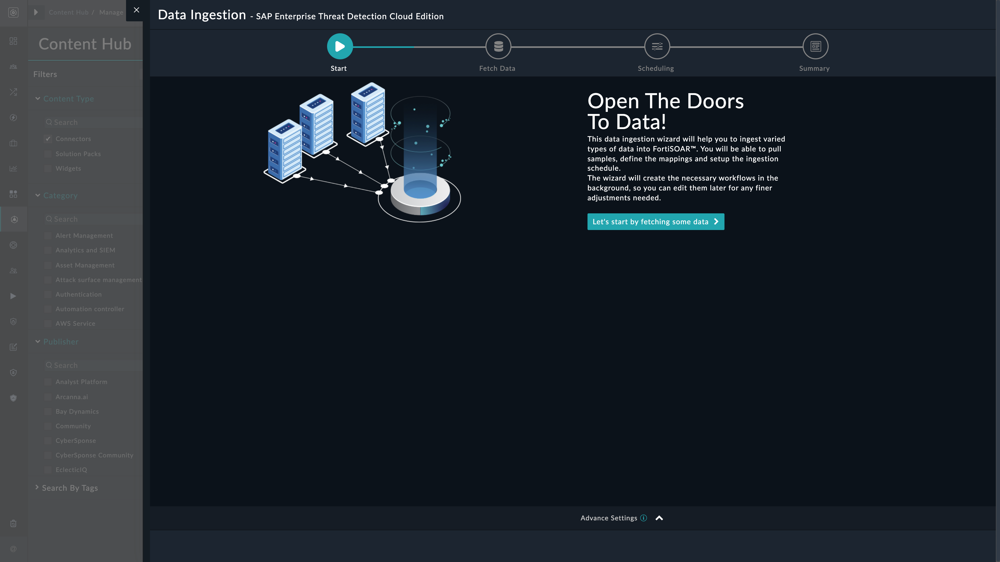
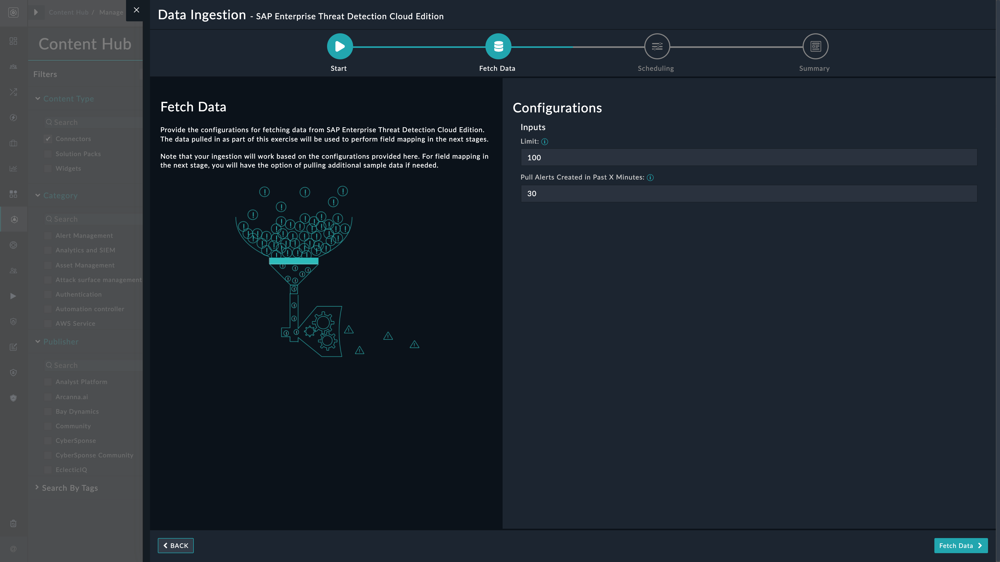
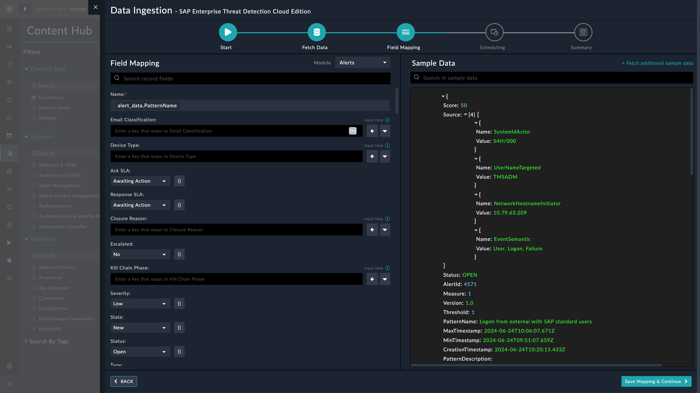
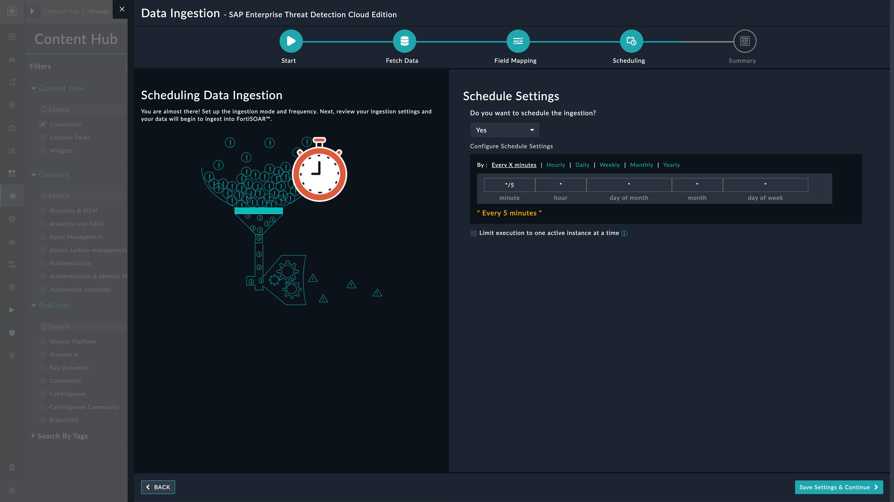

## About the connector
SAP Enterprise Threat Detection (ETD), Cloud Edition helps you to identify the real attacks as they are happening and analyze the threats quickly enough to neutralize them before serious damage occurs. SAP Enterprise Threat Detection Cloud Edition connector performs action like get and ingest Events, Alerts and Investigations.

This document provides information about the SAP Enterprise Threat Detection Cloud Edition Connector, which facilitates automated interactions, with a SAP Enterprise Threat Detection Cloud Edition server using FortiSOAR&trade; playbooks. Add the SAP Enterprise Threat Detection Cloud Edition Connector as a step in FortiSOAR&trade; playbooks and perform automated operations with SAP Enterprise Threat Detection Cloud Edition.

### Version information

Connector Version: 1.0.0

Authored By: Fortinet CSE

Contributors: Julian Petersohn

Certified: No

## Installing the connector

Use the <strong>Content Hub</strong> to install the connector. For the detailed procedure to install a connector, click <a href="https://docs.fortinet.com/document/fortisoar/0.0.0/installing-a-connector/1/installing-a-connector" target="_top">here</a>.

You can also use the <code>yum</code> command as a root user to install the connector:

<pre>yum install cyops-connector-sap-etd-cloud</pre>

## Prerequisites to configuring the connector
- You must have the credentials of SAP Enterprise Threat Detection Cloud Edition server to which you will connect and perform automated operations.
- The FortiSOAR&trade; server should have outbound connectivity to port 443 on the SAP Enterprise Threat Detection Cloud Edition server.

## Minimum Permissions Required
- Not applicable

## Configuring the connector
For the procedure to configure a connector, click [here](https://docs.fortinet.com/document/fortisoar/0.0.0/configuring-a-connector/1/configuring-a-connector)
### Configuration parameters

In FortiSOAR&trade;, on the Connectors page, click the <strong>SAP Enterprise Threat Detection Cloud Edition</strong> connector row (if you are in the <strong>Grid</strong> view on the Connectors page) and in the <strong>Configurations</strong> tab enter the required configuration details:

<table border=1><thead><tr><th>Parameter</th><th>Description</th></tr></thead><tbody><tr><td>Authentication URL</td><td>The Authentication URL is contained in the field `uaa.url` of the service key</td>
</tr><tr><td>ETD Data Retrieval URL</td><td>The Authentication URL is contained in the field `url` of the service key</td>
</tr><tr><td>Client ID</td><td>The Client ID is specified in the field `client id` in the service key.</td>
</tr><tr><td>Client Secret</td><td>The Client Secret is specified in the field `client secret` in the service key.</td>
</tr></tbody></table>

## Actions supported by the connector
The following automated operations can be included in playbooks and you can also use the annotations to access operations:
<table border=1><thead><tr><th>Function</th><th>Description</th><th>Annotation and Category</th></tr></thead><tbody><tr><td>Get Alerts</td><td>Retrieve alerts based on start and end date/time</td><td>  </td></tr>
<tr><td>Get Alert Details</td><td>Get Alert detail information based on specified alert ID</td><td>  </td></tr>
<tr><td>Get Investigations</td><td>Get alerts with expansion and filter for investigations.</td><td>  </td></tr>
</tbody></table>

### operation: Get Alerts
#### Input parameters
<table border=1><thead><tr><th>Parameter</th><th>Description</th></tr></thead><tbody><tr><td>Limit</td><td>Specify the amount of results which will be returned.
</td></tr><tr><td>Start Time</td><td>Specify the date and time from which alerts should be received
</td></tr><tr><td>End Time</td><td>Specify the date and time until which the alerts should be received.
</td></tr></tbody></table>

#### Output

 No output schema is available at this time.
### operation: Get Alert Details
#### Input parameters
<table border=1><thead><tr><th>Parameter</th><th>Description</th></tr></thead><tbody><tr><td>Alert ID</td><td>Specify ID of the alert to retrieve details information.
</td></tr></tbody></table>

#### Output

 No output schema is available at this time.
### operation: Get Investigations
#### Input parameters
<table border=1><thead><tr><th>Parameter</th><th>Description</th></tr></thead><tbody><tr><td>Alert ID</td><td>Specify the ID of the alert to filter investigations for.
</td></tr><tr><td>Limit</td><td>Specify the limit the amount of results to retrieve
</td></tr></tbody></table>

#### Output

 No output schema is available at this time.

### Data Ingestion Support
Use the Data Ingestion Wizard to easily ingest data into FortiSOAR™ by pulling alert contents from SAP Enterprise Threat Detection Cloud. Currently, alert contents ingested from SAP Enterprise Threat Detection Cloud are mapped to alerts in FortiSOAR™. For more information on the Data Ingestion Wizard, see the Connectors Guide in the FortiSOAR™ product documentation.

#### Configure Data Ingestion
You can configure data ingestion using the Data Ingestion Wizard to seamlessly map the incoming SAP Enterprise Threat Detection Cloud alerts to FortiSOAR™ Alerts.

The Data Ingestion Wizard enables you to configure scheduled pulling of data from SAP Enterprise Threat Detection Cloud into FortiSOAR™. It also lets you pull some sample data from SAP Enterprise Threat Detection Cloud using which you can define the mapping of data between SAP Enterprise Threat Detection Cloud and FortiSOAR™. The mapping of common fields is generally already done by the Data Ingestion Wizard; users are mostly required to only map any custom fields that are added to the SAP Enterprise Threat Detection Cloud.

1. To begin configuring data ingestion, click Configure Data Ingestion on the SAP Enterprise Threat Detection Cloud connector's Configurations page.
Click Let's Start by fetching some data, to open the Fetch Sample Data screen:

    
    Sample data is required to create a field mapping between SAP Enterprise Threat Detection Cloud data and FortiSOAR™. The sample data is pulled from connector actions or ingestion playbooks.

2. On the Fetch Data screen, provide the configurations required to fetch SAP Enterprise Threat Detection Cloud data.
Type the time in minutes in the `Pull Alerts Created in Past X Minutes` field to specify the time from when you want to pull alerts from SAP Enterprise Threat Detection Cloud. Additionally, you can also specify a number in the Limit field, which will limit the alert records to be pulled from SAP Enterprise Threat Detection Cloud.

The fetched data is used to create a mapping between the SAP Enterprise Threat Detection Cloud data and FortiSOAR™ alerts. Once you have completed specifying the configurations, click Fetch Data.
3. On the Field Mapping screen, map the fields of an SAP Enterprise Threat Detection Cloud alert to the fields of an alert present in FortiSOAR™.
To map a field, click the key in the sample data to add the Jinja value of the field. For example, to map the `PatternName` parameter of an SAP Enterprise Threat Detection Cloud alert to the `Alert Name` parameter of a FortiSOAR™ alert, click the `Alert Name` field and then click the `PatternName` field to populate its keys:

For more information on field mapping, see the Data Ingestion chapter in the Connectors Guide in the FortiSOAR™ product documentation. Once you have completed mapping the fields, click Save Mapping & Continue.
4. Use the Scheduling screen to configure schedule-based ingestion, i.e., specify the polling frequency to SAP Enterprise Threat Detection Cloud, so that the content gets pulled from the SAP Enterprise Threat Detection Cloud Edition integration into FortiSOAR™.
On the Scheduling screen, from the Do you want to schedule the ingestion? drop-down list, select Yes.
In the Configure Schedule Settings section, specify the Cron expression for the schedule. For example, if you want to pull data from SAP Enterprise Threat Detection Cloud every morning at 5 am, click Daily, and in the hour box enter 5, and in the minute box enter 0:

Once you have completed scheduling, click Save Settings & Continue.
5. The Summary screen displays a summary of the mapping done, and it also contains links to the Ingestion playbooks. Click Done to complete the data ingestion, and exit the Data Ingestion Wizard.
